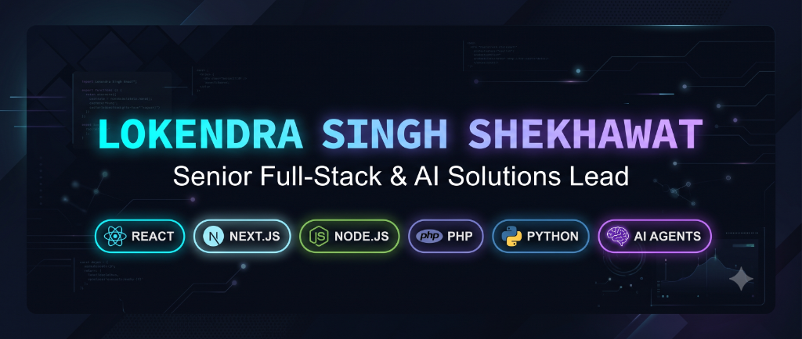
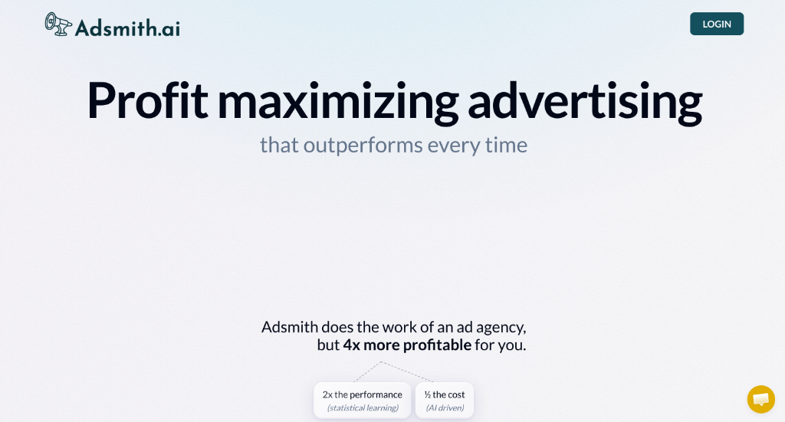
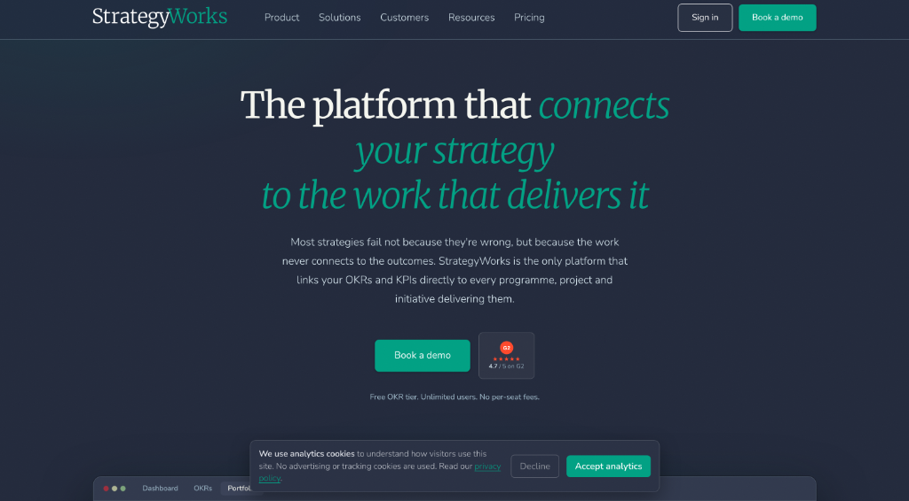
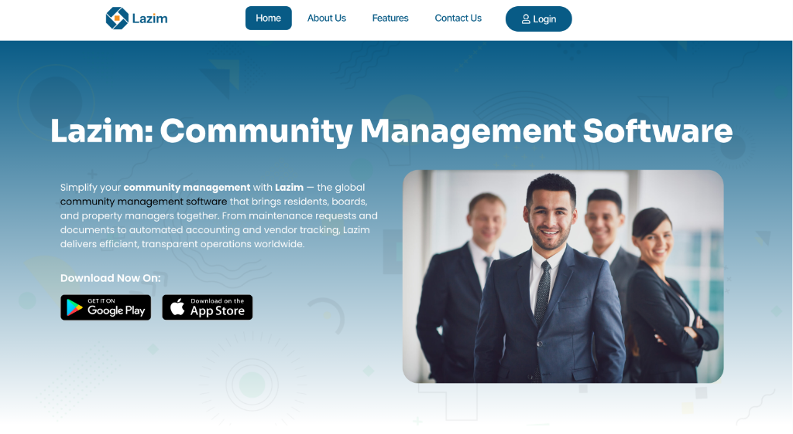
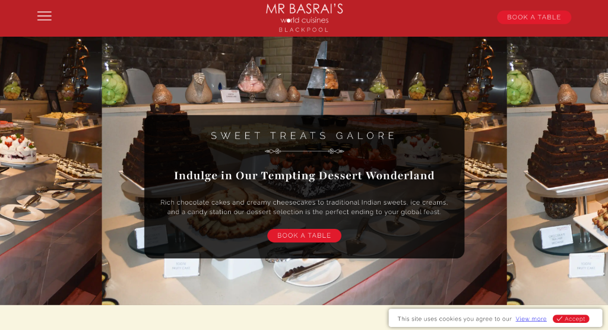
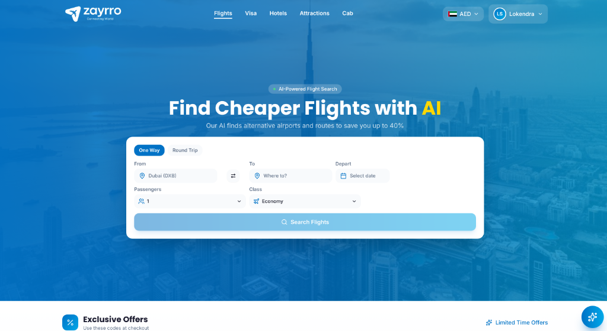
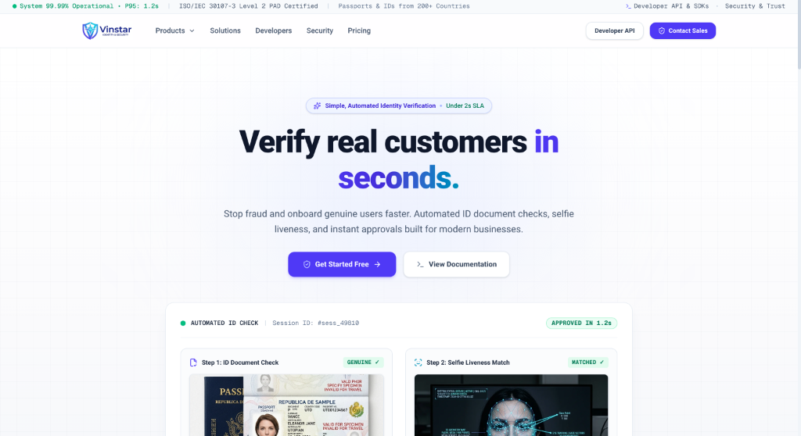
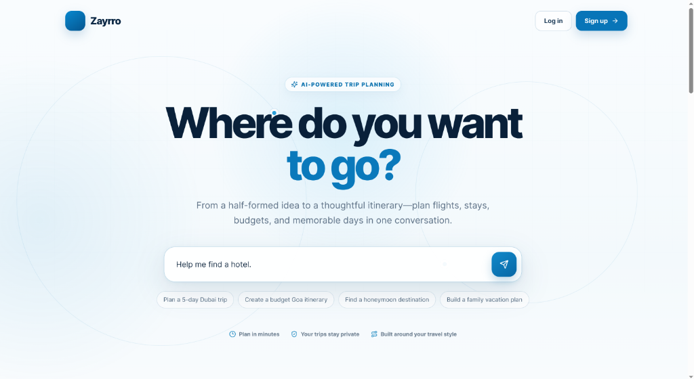

  

    

  <!-- Quick Social & Action Badges -->
  

    
    
    
    
  

  <!-- Status Bar -->
  

    📍 <b>Jaipur, Rajasthan, India</b> &nbsp;•&nbsp;
    💼 <b>Founder @ Eyvy Solutions</b> &nbsp;•&nbsp;
    🚀 <b>7+ Years Experience</b> &nbsp;•&nbsp;
    🟢 <b>Available for Projects & Retainers</b>
  

---

### 👨‍💻 Executive Summary

Senior Full-Stack Engineer and AI Solutions Lead with **7+ years of experience** building high-throughput web applications, enterprise SaaS platforms, and automated AI systems for startups, agencies, and enterprises worldwide.

* **Core Stack**: React, Next.js, Node.js, Express, PHP, Python, and FastAPI.
* **APIs & Real-Time**: High-speed REST APIs, Amadeus GDS Travel APIs, Stripe, WebRTC, and WebSockets.
* **AI & Automation**: Autonomous AI agent orchestration, OpenAI tool-calling pipelines, GPU document OCR, and biometric KYC.
* **Product Delivery**: Full-stack web development, SaaS MVPs, codebase modernization, bug fixing, and dedicated engineering retainers.

---

### 🛠️ Core Technology Stack

<table>
  <tr>
    <td width="22%" valign="top"><b>Frontend</b></td>
    <td>
      
      
      
      
      
      
      
    </td>
  </tr>
  <tr>
    <td valign="top"><b>Backend & APIs</b></td>
    <td>
      
      
      
      
      
      
      
    </td>
  </tr>
  <tr>
    <td valign="top"><b>AI & Automation</b></td>
    <td>
      
      
      
      
      
      
    </td>
  </tr>
  <tr>
    <td valign="top"><b>Databases & Cloud</b></td>
    <td>
      
      
      
      
      
      
      
      
    </td>
  </tr>
</table>

---

### 🚀 Featured Platforms & SaaS Products

<table>
  <!-- Row 1: Adsmith & StrategyWorks -->
  <tr>
    <td width="50%" valign="top">
      
        
      <b><a href="https://adsmith.ai/">Adsmith.ai</a></b> &nbsp; 
       
      <b>Next.js & AI Video Advertising Platform</b>
      
Autonomous AI video ad creation, multi-model rendering (Sora 2 Pro, Veo 3.1, LTX-2), and automated continuous campaign optimization across Meta and Google Ads.

      
      
      
      
    </td>
    <td width="50%" valign="top">
      
        
      <b><a href="https://strategyworks.io/">StrategyWorks</a></b> &nbsp; 
       
      <b>PHP Enterprise Strategy & PMO SaaS</b>
      
Robust enterprise platform linking executive board objectives to operational OKRs, KPIs, and delivery programmes with granular role-based access control.

      
      
      
      
    </td>
  </tr>

  <!-- Row 2: Lazim & Mr Basrai -->
  <tr>
    <td width="50%" valign="top">
      
        
      <b><a href="https://www.lazim.ae/">Lazim</a></b> &nbsp; 
       
      <b>Community ERP & GPU OCR Platform</b>
      
Property management ERP with GPU-accelerated invoice scanning and document OCR pipelines, achieving 95% automated bookkeeping extraction accuracy.

      
      
      
      
    </td>
    <td width="50%" valign="top">
      
        
      <b><a href="https://www.mrbasrai.com/">Mr Basrai's World Cuisines</a></b> &nbsp; 
       
      <b>Restaurant Chain & Online Reservation Engine</b>
      
High-speed restaurant booking web application with multi-location menus, achieving a 90+ Google PageSpeed mobile score.

      
      
      
      
    </td>
  </tr>

  <!-- Row 3: Zayrro & Vinstar IDV -->
  <tr>
    <td width="50%" valign="top">
      
        
      <b><a href="https://zayrro.com/">Zayrro</a></b> &nbsp; 
       
      <b>Multi-Supplier Travel Booking Platform</b>
      
High-concurrency travel booking aggregator integrating Amadeus GDS, Benzy, and Akbar Travels with -40% AI route cost savings algorithms.

      
      
      
      
    </td>
    <td width="50%" valign="top">
      
        
      <b><a href="https://vinstar.in/">Vinstar IDV</a></b> &nbsp; 
       
      <b>Automated Identity Verification & Video KYC</b>
      
Instant fraud detection and customer onboarding parsing 14,000+ document templates, ISO 30107-3 3D liveness, and WebRTC video KYC under 1.2s SLA.

      
      
      
      
    </td>
  </tr>

  <!-- Row 4: Zayrro AI Chat (Full Width Card) -->
  <tr>
    <td colspan="2" valign="top">
      
        
      <b><a href="https://chat.eyvy.in/">Zayrro AI Chat</a></b> &nbsp; 
       
      <b>Autonomous Conversational AI Travel Agent</b>
      
Conversational travel assistant orchestrating OpenAI models and custom tool calling to query live flight/hotel APIs, calculate optimal routes, and generate complete bookable itineraries in real-time streaming.

      
      
      
      
      
      
    </td>
  </tr>
</table>

---

### 💼 Professional Experience

* **Founder & Principal Engineer** — **Eyvy Solutions** *(Apr 2025 — Present · Jaipur, India)*
  * Architecting production web and AI platforms (Zayrro, Vinstar IDV, Zayrro AI Chat).
  * Engineered Generative AI multi-model video pipelines (LTX-2, Veo 3.1, Sora 2 Pro) and high-concurrency travel GDS API integrations.
* **Machine Learning Engineer** — **Ilaj Services** *(Jun 2024 — Apr 2025)*
  * Built GPU-accelerated document OCR microservices for real estate ERP, boosting throughput by 20% on AWS EC2.
* **Senior Software Engineer** — **Datamatics** *(Jan 2022 — Jun 2024 · Bangalore, India)*
  * Automated banking loan origination and underwriting workflows for IDFC First Bank LOS, cutting turnaround by 30%.
* **Software Developer** — **Ecloud Solutions** *(May 2019 — Jan 2022)*
  * Developed real-time WebRTC media applications, RESTful microservices, and interactive web apps.

---

### 📫 Connect & Collaborate

* 💼 **LinkedIn**: [linkedin.com/in/ldivrala](https://linkedin.com/in/ldivrala/)
* 🐙 **GitHub**: [@lokendra-shekhawat](https://github.com/lokendra-shekhawat)
* 📧 **Direct Email**: [s2lokendra@gmail.com](mailto:s2lokendra@gmail.com)
* 📍 **Location**: Jaipur, Rajasthan, India (IST · UTC+5:30)

  © 2026 Lokendra Singh Shekhawat · Eyvy Solutions

