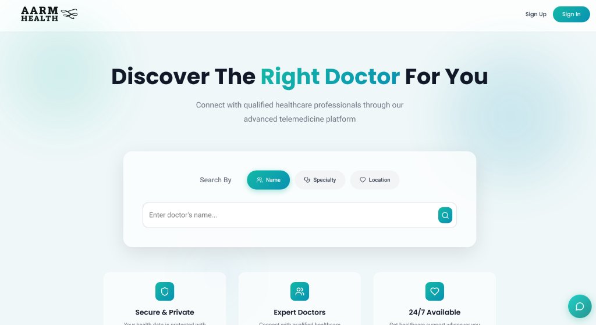

  # Lokendra Singh Shekhawat 👋
  ### Senior Full-Stack Web & SaaS Engineer · AI Solutions Lead
  #### Building Smart AI & High-Impact Digital Products

  

    <code>React</code> &nbsp;•&nbsp;
    <code>Next.js</code> &nbsp;•&nbsp;
    <code>Node.js</code> &nbsp;•&nbsp;
    <code>PHP</code> &nbsp;•&nbsp;
    <code>Python</code> &nbsp;•&nbsp;
    <code>FastAPI</code> &nbsp;•&nbsp;
    <code>AI Agents</code>
  

  

    
    
    
    
  

  

    📍 <b>Jaipur, Rajasthan, India</b> &nbsp;•&nbsp;
    💼 <b>Software Consultant @ Eyvy Solutions</b> &nbsp;•&nbsp;
    🚀 <b>7+ Years Experience</b> &nbsp;•&nbsp;
    🟢 <b>Available for Projects & Retainers</b>
  

---

### 👨‍💻 Executive Summary

Senior Full-Stack Engineer and AI Solutions Lead with **7+ years of experience** building high-throughput web applications, enterprise SaaS platforms, and automated AI systems for startups, agencies, and enterprises worldwide.

* **Core Stack**: React, Next.js, Node.js, Express, PHP, Python, and FastAPI.
* **APIs & Real-Time**: High-speed REST APIs, Amadeus GDS Travel APIs, Stripe, WebRTC, and WebSockets.
* **AI & Automation**: Autonomous AI agent orchestration, OpenAI tool-calling pipelines, GPU document OCR, and biometric KYC.
* **Product Delivery**: Full-stack web development, SaaS MVPs, codebase modernization, bug fixing, and dedicated engineering retainers.

---

### 🛠️ Core Technology Stack

<table>
  <tr>
    <td width="22%" valign="top"><b>Frontend</b></td>
    <td>
      
      
      
      
      
      
      
    </td>
  </tr>
  <tr>
    <td valign="top"><b>Backend & APIs</b></td>
    <td>
      
      
      
      
      
      
      
    </td>
  </tr>
  <tr>
    <td valign="top"><b>AI & Automation</b></td>
    <td>
      
      
      
      
      
      
    </td>
  </tr>
  <tr>
    <td valign="top"><b>Databases & Cloud</b></td>
    <td>
      
      
      
      
      
      
      
      
    </td>
  </tr>
</table>

---

### 🚀 Featured Platforms & SaaS Products

<table>
  <!-- Row 1: Adsmith.ai & StrategyWorks -->
  <tr>
    <td width="50%" valign="top">
      
        
      <a href="https://adsmith.ai/"><b>Adsmith.ai</b></a>
       
      
      &nbsp;
      
        
      <small><b>Lead Full-Stack & AI Engineer</b> &bull; <i>AI Video Advertising Platform</i></small>
        
      Autonomous AI video ad creation orchestrating multi-model rendering (Sora 2 Pro, Veo 3.1, LTX-2) and automated continuous campaign optimization across Meta and Google Ads.
        
      
      
      
      
    </td>
    <td width="50%" valign="top">
      
        
      <a href="https://strategyworks.io/"><b>StrategyWorks</b></a>
       
      
      &nbsp;
      
        
      <small><b>Solutions Architect & Full-Stack Lead</b> &bull; <i>Enterprise PMO SaaS</i></small>
        
      Robust enterprise strategy platform linking executive board objectives to operational OKRs, KPIs, and delivery programmes with real-time reporting and multi-tenant security.
        
      
      
      
      
    </td>
  </tr>

  <!-- Row 2: Zayrro & Zayrro AI Chat -->
  <tr>
    <td width="50%" valign="top">
      
        
      <a href="https://zayrro.com/"><b>Zayrro</b></a>
       
      
      &nbsp;
      
        
      <small><b>Software Consultant & Principal Architect</b> &bull; <i>Multi-Supplier Travel Engine</i></small>
        
      High-concurrency travel booking aggregator integrating Amadeus GDS, Benzy, and Akbar Travels with AI-assisted alternative routing algorithms and instant booking checkout.
        
      
      
      
      
    </td>
    <td width="50%" valign="top">
      
        
      <a href="https://chat.eyvy.in/"><b>Zayrro AI Chat</b></a>
       
      
      &nbsp;
      
        
      <small><b>Software Consultant & AI Agent Architect</b> &bull; <i>Autonomous AI Travel Assistant</i></small>
        
      Conversational AI agent orchestrating multi-step LLM tool calling to query live flight and hotel APIs, calculate optimal routes, and stream complete bookable itineraries in real time.
        
      
      
      
      
    </td>
  </tr>

  <!-- Row 3: Vinstar IDV & Lazim -->
  <tr>
    <td width="50%" valign="top">
      
        
      <a href="https://vinstar.in/"><b>Vinstar IDV</b></a>
       
      
      &nbsp;
      
        
      <small><b>Lead Full-Stack & AI Architect</b> &bull; <i>Automated IDV & Video KYC</i></small>
        
      Instant fraud detection and customer onboarding parsing 14,000+ document templates, ISO 30107-3 3D biometric liveness detection, and WebRTC video KYC.
        
      
      
      
      
    </td>
    <td width="50%" valign="top">
      
        
      <a href="https://www.lazim.ae/"><b>Lazim</b></a>
       
      
      &nbsp;
      
        
      <small><b>Machine Learning Engineer</b> &bull; <i>Real Estate ERP & GPU OCR</i></small>
        
      Property management ERP platform featuring GPU-accelerated invoice scanning and document OCR pipelines to automate high-volume real estate bookkeeping workflows.
        
      
      
      
      
    </td>
  </tr>

  <!-- Row 4: Mr Basrai's World Cuisines & AARM Health -->
  <tr>
    <td width="50%" valign="top">
      
        
      <a href="https://www.mrbasrai.com/"><b>Mr Basrai's World Cuisines</b></a>
       
      
      &nbsp;
      
        
      <small><b>Senior Full-Stack Developer</b> &bull; <i>Hospitality & Reservations</i></small>
        
      Modern culinary web platform featuring interactive table reservations, multi-branch location menus, and seamless high-speed customer mobile booking flows.
        
      
      
      
      
    </td>
    <td width="50%" valign="top">
      
        
      <a href="https://aarmhealth.com/"><b>AARM Health</b></a>
       
      
      &nbsp;
      
        
      <small><b>Frontend & UI Architecture Lead</b> &bull; <i>Telemedicine Platform</i></small>
        
      Digital healthcare platform connecting patients with certified doctors, featuring instant medical specialty filtering, secure OTP auth, and online appointment booking.
        
      
      
      
      
    </td>
  </tr>
</table>

---

### 💼 Professional Experience

* **Software Consultant & Principal Engineer** — **Eyvy Solutions** *(Apr 2025 — Present · Jaipur, India)*
  * Architecting production web and AI platforms (Zayrro, Vinstar IDV, Zayrro AI Chat).
  * Engineered Generative AI multi-model video pipelines (LTX-2, Veo 3.1, Sora 2 Pro) and high-concurrency travel GDS API integrations.
* **Machine Learning Engineer** — **Ilaj Services** *(Jun 2024 — Apr 2025)*
  * Built GPU-accelerated document OCR microservices for real estate ERP, boosting throughput by 20% on AWS EC2.
* **Senior Software Engineer** — **Datamatics** *(Jan 2022 — Jun 2024 · Bangalore, India)*
  * Automated banking loan origination and underwriting workflows for IDFC First Bank LOS, cutting turnaround by 30%.
* **Software Developer** — **Ecloud Solutions** *(May 2019 — Jan 2022)*
  * Developed real-time WebRTC media applications, RESTful microservices, and interactive web apps.

---

### 📫 Connect & Collaborate

* 💼 **LinkedIn**: [linkedin.com/in/ldivrala](https://linkedin.com/in/ldivrala/)
* 🐙 **GitHub**: [@lokendra-shekhawat](https://github.com/lokendra-shekhawat)
* 📧 **Direct Email**: [s2lokendra@gmail.com](mailto:s2lokendra@gmail.com)
* 📍 **Location**: Jaipur, Rajasthan, India (IST · UTC+5:30)

  © 2026 Lokendra Singh Shekhawat · Eyvy Solutions

